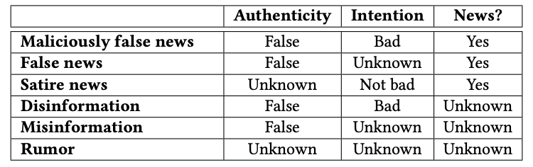

# Building a Classifier for Source Reliability Estimation

A machine learning classifier to distinguish between reliable and unreliable sources for my Proof and Persuasion class.


## Past Work and New Goals
I have worked on a problem similar to this in the past. As an eighth grader, I investigated binary article classification(into 'fake news' and 'real news', which I have now found is too general) by downloading a corpus of data that was split into 'real' and 'fake' and extracting five simplistic values from each article: body text, title, sentiment analysis score, date published, and source url. I then used the boilerplate Matlab neural network classifier to run the training data through and produce a model.

Although the actual past code of my past work was not helpful, I did have an advantage in terms of the research I'd done previously. It was from this past project that I knew that separation between training data and testing data is necessary. Also, I'd read a lot of papers on methods necessary to build a classifier for reliability(though I hadn't implemented any of the methods). 

As I transitioned in 10th grade from the past project to this project, I recognized that it is easier(and more technically feasible) to implement _source reliability_ than to try to classify articles into 'fake news' and 'real news', especially since the actual definition of 'fake news' varies widely. Although I started out with a mission to factcheck articles(by checking sources and statements), I soon found this to be non-feasible for the timeframe, processing power, and technical experience I have. Therefore, I moved to source reliability in order to attack the assignment from a different angle.

## Background and Definitions

A _classifier_ is a machine learning model that attempts to 'sort' individual test cases into a set number of categories. The model is trained using _training data_ and tested using _testing data_. These two datasets do not overlap.

_Accuracy_ for the purposes of this project will be defined as (1) lack of misinformation (including incorrect statistics or loaded epithets) and (2) lack of 'agenda' (not associated with bad intention or deliberate misrepresentation). This term is interchangeable with _factuality_.

When I discuss 'weighting' in this project, I am referring to normalized values for different cases. As of now, I am choosing the weight parameters by hand based on iteration; however, I would like to develop a more scientific method in the future. This affects URL ending and main platform.

Several types of data are used as part of the featureset(or list of covariates): text data('strings'), true or false flags('booleans') or numbers. 
## Why does this project matter?

Disinformation and misinformation are becoming ever more influential in today's world. As it becomes easier to share information, it becomes more important that we develop quick and accurate ways of fact-checking that information. This project aims to begin this process by offering a simple method for Source Reliability Estimation, which 'grades' sources according to political bias, factuality, and sentiment. 

## How does this classifier work?

The featureset for this classifier is: 
* Page URLS
  - URL ending(.edu has higher truth weightage than .com, for example). A special case here: .co urls are given a negative weighting because they often 'impersonate' .com websites. The limit here is that I have created the weightings to maximize accuracy for my specific dataset-- I'm still looking for ways to remove the human element from this process.
  - Length- according to Baly(2018), less factually accurate websites tend to have longer URLS. _Please note that this is only used in the case of extremely long URLs, as they may be malicious._ In the case of any URL length below the threshold, this covariate is not taken into account. 
  - Main platform (if the article is hosted on [https://science.sciencemag.org/](https://science.sciencemag.org/) it is more likely to be factual than if it's on an independent blogging site like Medium or Blogger). In effect, we are just penalizing specific sites that have lower author standards here(a negative covariate). 
* Text analysis
  - Articles with a high sentiment analysis score are less likely to be impartial, so they will receive a lower accuracy index. Sentiment analysis really just measures the strength of emotion in the text, and factual news articles are less likely to include strong emotion(through common sense).
  - According to Horne(2017), fake news contains less text within the body, and a longer title. (Horne proposes more advanced methods than this for categorizing 'fake news', but due to processing constraints, I was not able to implement these methods. In the future, I want to broaden and optimize to include the more advanced methods.)
* Twitter data
  - If the bio of the Twitter profile includes a link to the original website, this is a slight positive factor, since this verifies the match between the two accounts. 
  - If the profile is verified, this is a major positive factor as users must submit personal identification and justification to be verified by Twitter, and non-accurate sites are less likely to go through that process.
  - The date of the account creation can indicate reliability to a point, since less reliable websites are often newer, less-supported endeavors.
  - A large amount of consisistent user engagement(impressions and actions) can indicate veracity, although this is only a slight positive factor since fake news can be consistently shared without being true (Baly 2018).
  - At the suggestion of Dr. Bhardwaj, I decided to consider a user's previous activity(which accounts they retweet) as part of the Twitter data. Since this is single-user exporting, it is within the Twitter API's Terms of Service. The algorithm currently scans the last 5 retweets and runs source reliability estimation on the 5 retweeted accounts. This creates a list of 5 boolean(true or false) values. In the future, I'd like to expand this to the accounts the given account follows. However, these accounts usually follow many other accounts and there's no established method of ranking the 'following' list. 
* Wikipedia data
  - This is just a boolean value for the existence of a matching Wikipedia page. If a news site has a Wikipedia page, then the value will be `true`; otherwise, the value will be `false`. This exists because more prominent or reliable sources are more likely to have a Wikipedia page.
  - There is also a string tuple(meaning, a list of words) for the keywords the page is registered under, if there is a page available. This is because sources like Breitbart have Wikipedia pages, but they include keywords like 'far-right', 'conspiracy theories', and 'xenophobic'. In contrast, sources like the New York Times include keywords like 'worldwide influence', 'Pulitzer Prizes', and 'national'. We don't want to consider both of these the same, as they would be if we included only the first parameter. 


The classifier returns a binary value: factual or non-factual. In the future, I'd like to allow for a continuum. 

At the time of submission, the classifier has an 87% accuracy with a null accuracy of 50%. This is testing accuracy- the classifier was trained on a separate dataset and then tested on data it hadn't seen before.

The full set is pasted below:

```
    traffic:    alexa
    url:        ending, char_length, web_platform
    twitter:    has_twitter, created_when, verified, url_match, follow_count
    wikipedia:  has_wiki, wikicategories
    articles:   body_length, title_length, body_sentiment
```

## Notes and Future Projects

It is important to note that this project does not rate individual articles; it only rates sources. Also, Twitter scraping is against Twitter's current [Terms of Service](https://twitter.com/en/tos), so I used an existing corpus of data, which may not be recent enough for our purposes. However, this is not likely to appreciably influence the results of this project. According to my ablation study, the Twitter data that could have changed(mainly user engagement) would influence the accuracy by no more than 5%. An ablation study allows researchers to isolate a certain feature of a machine learning model and measure its impact on the accuracy of the classifier.

The project does not differentiate between different types of mis/disinformation, and it may misclassify satire, since this subset is not deliberately represented in the corpus of data used. Zhou et. al(2018) outline a categorization in their literature review, printed below:



In the future, I'd like to create a Chrome Extension that leverages this classifier in real time. This would allow users to immediately get the rating, and would encourage users to look deeper into the veracity of an article before sharing. The spread of misinformation is one of the main reasons 'fake news' is so pervasive.


I also brought this idea to a team at Harvard. The repository for the ensuing project is here: https://github.com/Omairss/BeyondBias.

## Process

I built this project over one week of work in response to an assignment calling for research on factchecking strategies. I extended the assignment by building a practical tool for factchecking, which is a classifier that reads in csv files and outputs notated articles. 

The main challenge in this process was acquiring a high-quality corpus of data that matched and connected all of the features I wanted to work with. I ended up running several web scraping programs. I will upload the full data soon; its current size is too large to upload to a Github repo.

## License

This project is licensed under the MIT License - see the [LICENSE.md](LICENSE.md) file for details

## Acknowledgments

* Hat tip to the makers of the amazing [GitHub README template](https://gist.githubusercontent.com/PurpleBooth/109311bb0361f32d87a2/raw/8254b53ab8dcb18afc64287aaddd9e5b6059f880/README-Template.md), which helped me structure this writeup
* The full citation for this project is at [CITATIONS.md](CITATIONS.md) in Chicago form. Also, part 3 of this assignment is included as an annotated bibliography. Sources were mainly found through Arxiv searches.
* I would like to thank my Proof and Persuasion teacher, Dr. Bhardwaj, for supporting me in the structure of this assignment. 
* I would like to thank my friend, Caroline Rothmann '22, for reading over this writeup as a non-CS person.

(1498 words)
